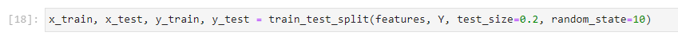
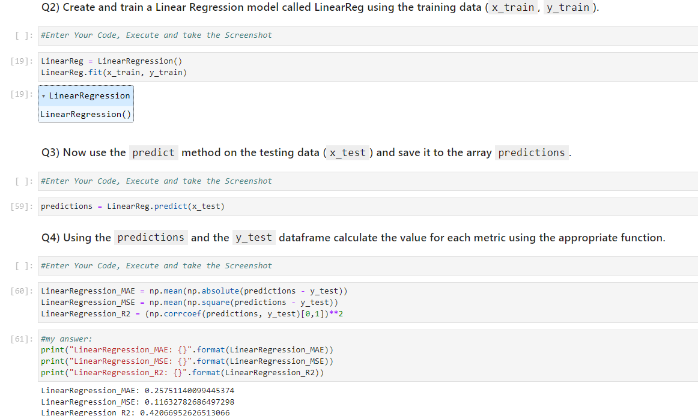
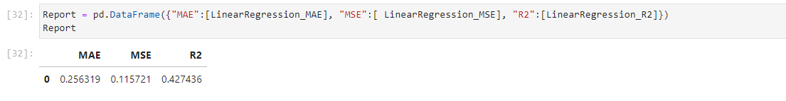
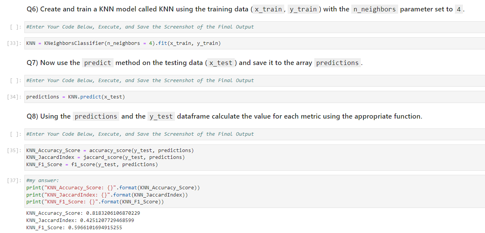
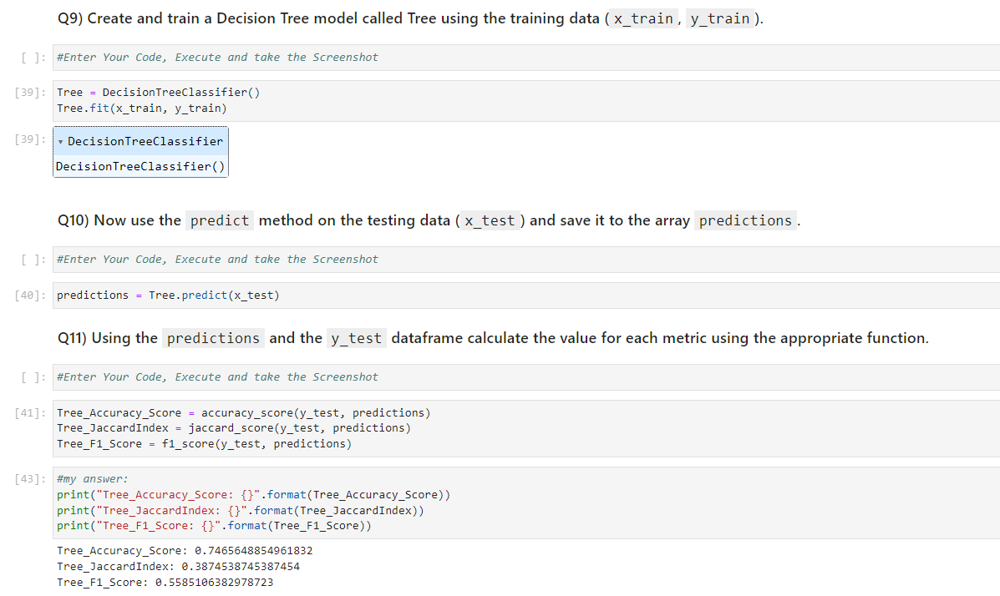
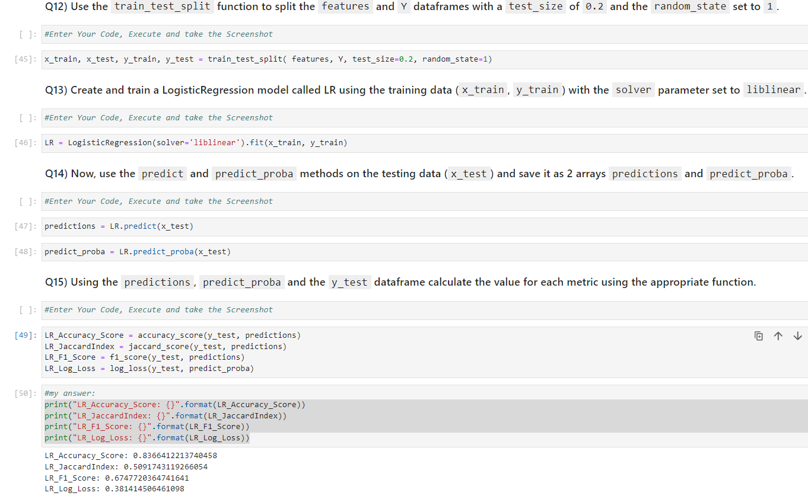
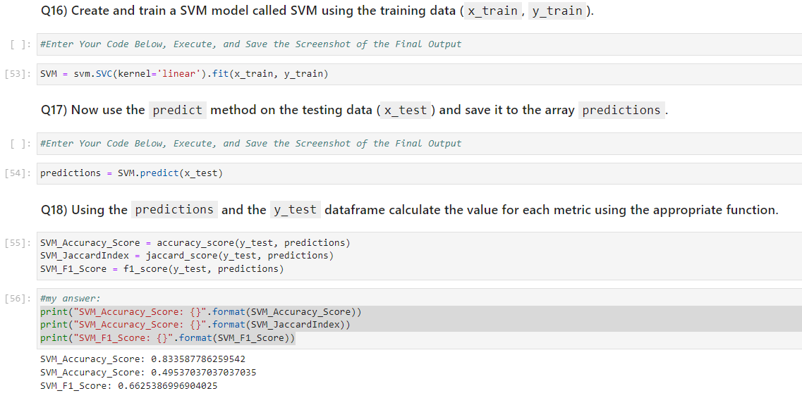
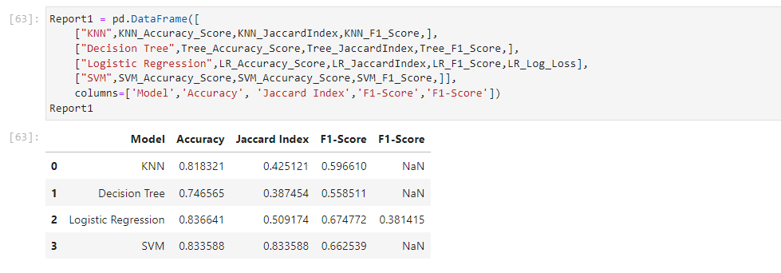

Machine Learning with Python | Course | IBM

# Machine-Learning-with-Python

| → [Completed Notebook](https://github.com/wy-chan/Machine-Learning-with-Python/blob/main/ML0101EN_SkillUp_FinalAssignment.jupyterlite_Completed.ipynb) |
| --- |

 

---

### 1. Splitting the dataset into training and testing data for regression (3 marks)

||
|---|
---

### 2. Building and training a model using Linear Regression and calculating evaluation metrics (8 marks)
  
||
|---|
---
 

### 3. Creating a final regression report/table of evaluation metrics (3 marks)

||
|---|
---

### 4. Building and training a model using KNN and calculating evaluation metrics (8 marks)

||
|---|
---

### 5. Building and training a model using Decision Trees and calculating evaluation metrics (8 marks)

||
|---|
---

### 6. Building and training a model using Logistic Regression and calculating evaluation metrics (9 marks)
    
||
|---|
---

### 7. Building and training a model using SVM and calculating evaluation metrics (8 marks)
 
||
|---|
---
   

### 8. Creating a final classification report/table of evaluation metrics (3 marks)

||
|---|
---

- <a href="#top">Back to top</a> -

